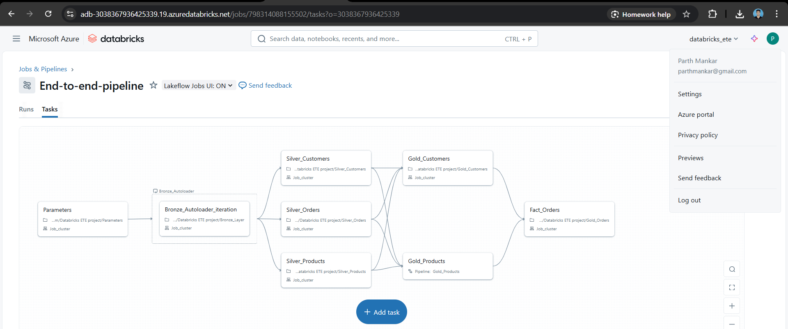
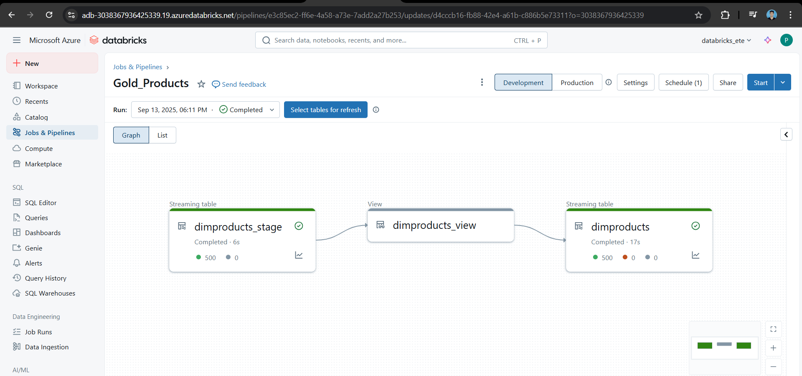

# Azure Databricks Medallion Lakehouse

## Overview
This project implements a production-grade Medallion Lakehouse pipeline using Azure Databricks, Delta Live Tables (DLT), and PySpark. It follows the bronze (raw), silver (processed), and gold (analytics) layered architecture with streaming ingestion, SCD Type 2 logic, and star schema design for scalable analytics.

## Architecture
  
*Figure 1: End-to-End Medallion Architecture Pipeline*

  
*Figure 2: Delta Live Tables (DLT) Pipeline Architecture*

## Folder Structure
- `/notebooks`: Databricks notebooks and pipeline scripts  
- `/data`: Source data in Parquet format  
- `/images`: Architecture diagrams and screenshots  

## Technologies Used
- Azure Databricks  
- Delta Live Tables (DLT)  
- PySpark  
- Unity Catalog  
- Parquet file format  
- Git and GitHub version control  

## Setup Instructions
1. Clone the repository  
2. Upload notebooks from `/notebooks` to your Databricks workspace  
3. Ensure Parquet files from `/data` are accessible in your Databricks environment  
4. Modify parameters in `/notebooks/Parameters.ipynb` as needed  
5. Execute notebooks in the following order:  
   - Bronze Layer ingestion  
   - Silver Layer transformations  
   - Gold Layer fact and dimension tables  

## Pipeline Execution Flow
- **Bronze Layer:** Raw data ingestion using Autoloader for streaming file ingestion  
- **Silver Layer:** Data cleansing, deduplication, and application of business logic  
- **Gold Layer:** Building analytics-ready dimensional and fact tables with SCD Type 1 & Type 2 handling and star schema optimization  

## Data Sources
Sample datasets in Parquet format stored under `/data` to enable reproducibility and testing.

## Key Features
- Streaming ingestion with scalable Autoloader  
- Slowly Changing Dimension Type 2 implementation for accurate historical tracking  
- Clear medallion architecture enabling separation of concerns and incremental processing  
- Data quality enforcement and schema evolution support  
- Incremental updates and efficient merges enabled by Delta Lake  

## Future Enhancements
- Add automated data quality dashboards and alerts  
- Implement additional machine learning pipelines on the gold layer  
- Integrate with BI tools for live reporting and dashboarding  

## Author
Parth
- GitHub: [parthani07](https://github.com/parthani07)  
- LinkedIn: [parth-205454190](https://www.linkedin.com/in/parth-205454190/) 
